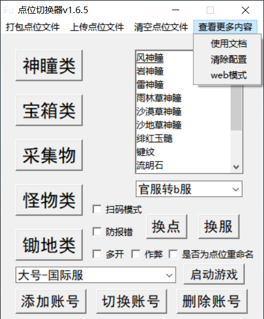
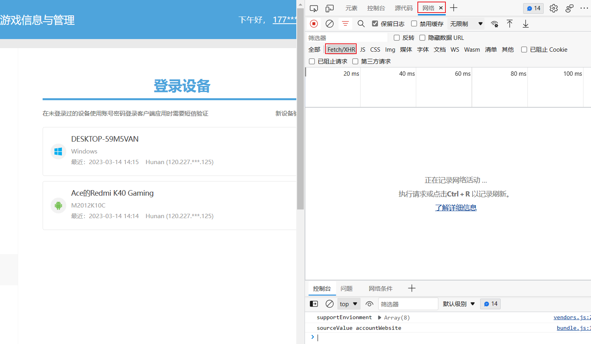
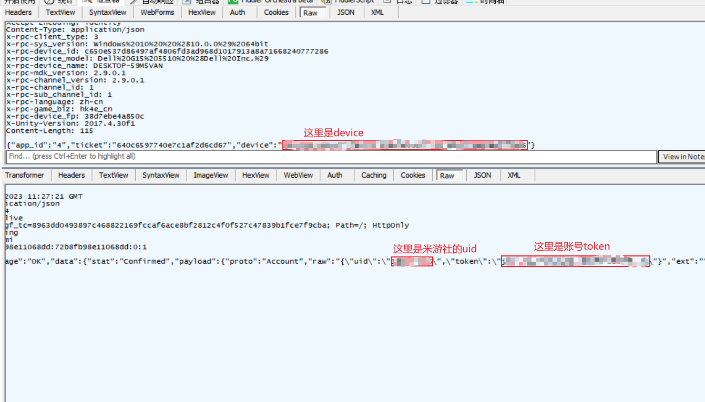
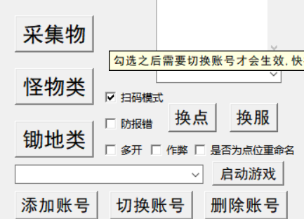

# 原神点位切换器
### 打包方法：```pyinstaller -F -w -i ico.ico point_switch.py```
### 使用方法：下载releases的安装程序，不要安装在游戏目录或者作弊目录，选择游戏的启动程序和作弊程序，国际服的转换包需要额外下载，如果你出现注入失败，可以✓上防报错打开(使用此方式打开的作弊程序无法多开)
#### 快捷键:F9打开扫码窗口，F10隐藏窗口, F11显示窗口, F12快速导出当前的账号配置(需手动重命名)
**预览：**




### 如何添加扫码的账号信息：
**首先你得有一款抓包程序，这里使用的是fiddler，需要指定只抓包原神**

**先把没必要的数据先清空，然后使用米游社或者其他程序扫码登录需要保存的账号，之后回到抓包界面并停止抓包**

**找到post地址为://hk4e-sdk.mihoyo.com/hk4e_cn/combo/panda/qrcode/query的，并且返回的数据内stat数值是confirmed的这条数据**

**在上面可以找到我们发包时携带的device和米游社的uid以及账号登录的token，复制这些数据时一定不要多复制任何多余符号，即使是引号**  
  
**勾选扫码登录之后点击添加账号，按照顺序依次输入账号的名称，米游社uid，device，账号token**
**全部完成之后就可以正常登录了，快捷键F9即可打开扫码窗口**
